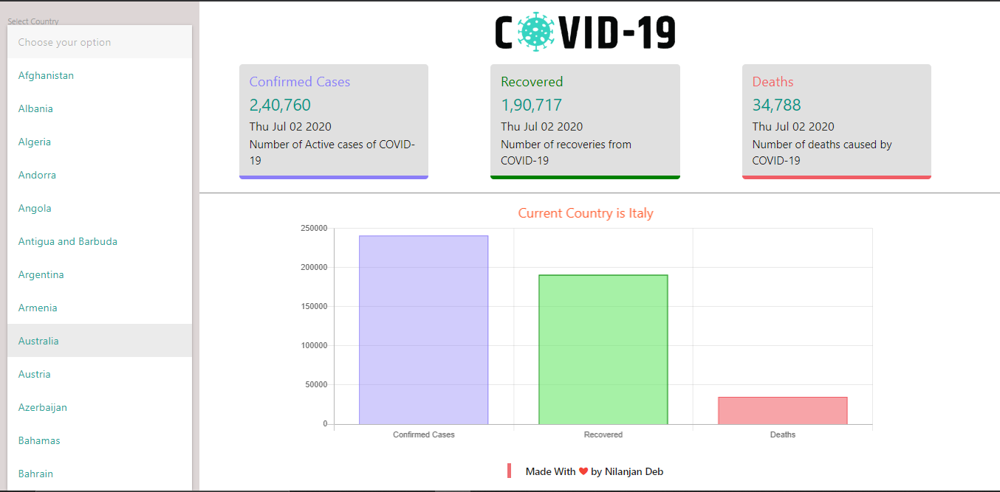

# Covid 19 Tracker Web App

- #### This site is live [here](https://covid-v2.netlify.app).
- #### Github Repository [link](https://github.com/nil1729/covid-tracker-v2).

---

### Modules used for this Project

1. _`React JS`_ is used as frontend Framework for building SPA.
2. _`Materialize-CSS`_ is used as CSS Framework and the website is Responsive for mobile and desktop.
3. _`ChartJS`_ is used for charting the Data got from APIs.
4. Easily Understandable to all users.

---

### Website Preview

## 

Made With &#10084; by <a href="https://github.com/nil1729" target="_blank"> Nilanjan Deb </a> 

